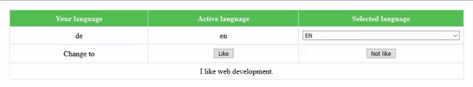

# MultilingualismJS
In many cases, plug-ins are used for the automatic translation of a website.
However, in some cases an accurate or controlled translation is important.
For these cases the lightweight *MultilingualismJS* library can be used.

# How to use
The library can be used in two ways.
Firstly, translations can be written directly into the `mul-js` element.
This is useful if the respective text or word is only used once.
However, if a text or word is used several times, the translation can also be registered under a `reg-id`.

Below is an example in which a greeting is displayed twice.
```HTML
<!-- With direct translation definition it would look like this -->
<mul-js en="Hello" de="Hallo" fra="Bonjour" jpn="こんにちは"></mul-js>
<mul-js en="Hello" de="Hallo" fra="Bonjour" jpn="こんにちは"></mul-js>

<!-- With the regristration it would look like this -->
<mul-js reg-id="HELLO"></mul-js>
<mul-js reg-id="HELLO"></mul-js>
<script>
  MultilingualismJs.register('HELLO', {
    'en':  'Hello',
    'de':  'Hallo',
    'fra': 'Bonjour',
    'jpn': 'こんにちは',
  });
</script>

<!-- The default language (language of the browser) can be overwritten with 'setLanguage(string)'. -->
<script>
  MultilingualismJs.setLanguage('fra');
</script>

<!-- 
  In some cases a manual update is required.
  For this there is the function 'scan()'.
-->
<script>
  /* Deep update
   * Resets all registered translations.
   * Is used when elements are inserted at runtime.
   */
  MultilingualismJs.scan();

  /* Superficial update
   * Triggers an update in the elements to apply existing translations.
   * Is used when language is updated (is done automatically on language cahnge)
   */
  MultilingualismJs.scan(false);
</script>
```